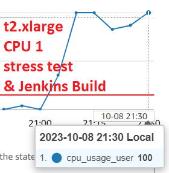
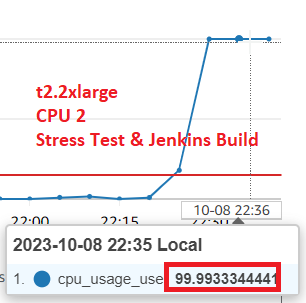
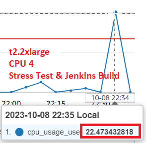

# Monitor Applications and Server Resources

October 7, 2023

By:  Annie V Lam - Kura Labs

# Purpose

After deploying the new version of the URL Shortener application, the QA engineer initiated 14,000 requests to the server; unfortunately, 510 of these requests encountered failures.

## Configuration for Testing

**Updated the application.py file to include logging**

**Configured Nginx in order for it to receive more request**

Updated from "worker_processes auto" to "worker_processes 8"

Updated from "worker_connections 768" to "worker_connections 2000"

Uncomment "Multi_accept on;

Uncomment all lines with "gzip.."

**Installed a package for stress testing**

sudo apt install stress-ng

**Added a shell script with a code to stress test**

sudo nice -n -20 stress-ng --cpu 2

This script stress tests two CPUs with high-priority

## Result of QA Engineer's 14,000 requests while running sudo nice -n -20 stress-ng --cpu 2

We have been notified that our recent QA testing results were not as we had hoped. Out of the 14,000 requests made, 510 of them unfortunately failed. Additionally, we received an email notification from Cloudwatch indicating that our CPU usage had reached 100%.

## SRE TESTING and ANALYSIS

Sending 14,000 requests to our server while executing the script sudo nice -n -20 stress-ng --cpu 2 has placed a significant strain on our server. This script is designed to allocate a workload to two of our CPUs in order to test their resiliency.

**SRE TESTING for t2.medium**

Here is an illustrative example of CPU usage on a t2.medium instance, which utilizes 2 CPUs, while running the stress test with the command sudo nice -n -20 stress-ng --cpu 2:

During the execution of the stress test, specifically the command sudo nice -n -20 stress-ng --cpu 2, within a t2.medium instance where no external requests or Jenkins builds were in progress, we observed both CPUs already operating at 99% capacity. This indicates that our current configuration with two CPUs is insufficient to handle the load.

To address this issue, we should consider upgrading our CPU capacity. The next available options are 4 CPUs and 8 CPUs. However, given that we rely on a single server to manage all three tiers – the Web Tier, the Application Tier, and the Data Tier – even 4 CPUs may potentially be pushing the limits of our server's capabilities. Further evaluation and load testing may be necessary to determine the optimal CPU configuration for our setup.

**SRE TESTING for t2.xlarge**

Below is an illustrative representation of CPU usage on a t2.xlarge instance, which boasts 4 CPUs. This instance is concurrently running the stress test with the command sudo nice -n -20 stress-ng --cpu 2 while managing multiple Jenkins builds:

While executing the stress test with the command sudo nice -n -20 stress-ng --cpu 2 and concurrently managing multiple Jenkins builds on a t2.xlarge instance equipped with 4 CPUs, the performance metrics indicated that three of the CPUs were consistently operating at approximately 75% capacity or higher, while one CPU was running at around 14%.

Given these observations, it's evident that our current setup with 4 CPUs may not be sufficiently robust to handle the additional stress of a minimum of 14,000 requests under these conditions. Further optimization or consideration of an upgrade might be necessary to ensure our system can comfortably manage such loads.

## Recommendations

To enhance our system's performance and accommodate the increased workload, we recommend upgrading the number of CPUs to 8. Two viable options for this upgrade are the t2.2xlarge and the c5.2xlarge instances. The key distinction between these two options lies in their memory capacity, with the former offering 32 GiB and the latter providing 16 GiB of memory, respectively. Given that this instance serves as the host for our data tier, opting for the t2.2xlarge with 32 GiB of memory is the recommended choice to ensure optimal performance and scalability.
   

   
Another recommendation is to partition the application tier and data tier into a distinct instance structure. Specifically, we propose deploying the web tier on an instance boasting 4 CPUs, while the application and data tiers share an instance with 2 CPUs.

This reconfiguration offers the significant advantage of enhancing the security posture of both the application and data tiers. By isolating these tiers from the web tier, it will reinforce the system's security. Nevertheless, it is crucial to be mindful that implementing this change will result in additional costs, as an extra instance will be required. Careful consideration should be given to these financial implications while evaluating the enhanced security benefits.

## Implemented Solution

We have initiated the creation of a new instance with the t2.2xlarge instance type. For detailed instructions on setting up the instance and performing the required installations for the URL Shortener application, please refer to the [deployment_4 repository](https://github.com/LamAnnieV/deployment_4.git) 

Please take note of the following specific details:
-  While referencing deployment_4, please be aware that the instance type mentioned there was t2.medium. For this new instance, we are using the more robust t2.2xlarge configuration.
-  The instance will be placed within the "deploy_4-subnet-public2" subnet.
-  Port 8000 will be removed from the security group settings.
-  An unused route table has been successfully removed from our configuration.
-  Once successful testing is completed on the t2.2xlarge instance, the previous t2.medium instance will be terminated as part of our resource management strategy.

**SRE TESTING for t2.2xlarge**

In the case of a t2.2xlarge instance, equipped with 8 CPUs and actively running both the stress test (sudo nice -n -20 stress-ng --cpu 2) and multiple Jenkins builds simultaneously, it's notable that all CPUs are currently in an 'IN ALARM' state.

Among the 8 CPUs, two are operating at full capacity, with their usage at 100%, while the remaining six CPUs exhibit usage levels ranging between 17% to 23%. Here's the individual CPU status:

The Jenkins build executed successfully:

The URL Shortener can no longer be launched from port 8000:

The URL Shortener is only accessible via port 5000:

## Diagram the VPC Infrastructure and the CI/CD Pipeline

Note: ChatGPT was used to enhance the quality and clarity of this documentation
