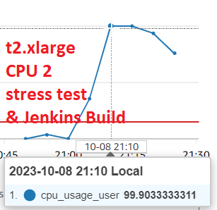
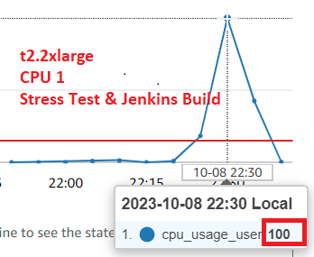

# Monitor Applications and Server Resources

October 7, 2023

By:  Annie V Lam - Kura Labs

# Purpose

After deploying the new version of the URL Shortener application, the QA engineer initiated 14,000 requests to the server; unfortunately, 500 of these requests encountered failures.

## Configuration for Testing

**Updated the application.py file to include logging**

**Configured Nginx in order for it to receive more request**

Updated from "worker_processes auto" to "worker_processes 8"

Updated from "worker_connections 768" to "worker_connections 2000"

Uncomment "Multi_accept on;

Uncomment all lines with "gzip.."

**Installed a package for stress testing**

sudo apt install stress-ng

**Added a shell script with a code to stress test**

sudo nice -n -20 stress-ng --cpu 2

This script stress tests two CPUs with high-priority

## Result of QA Engineer's 14,000 requests while running sudo nice -n -20 stress-ng --cpu 2

We were notified that we did not pass the QA testing, out of the 14,000 requests 500 requests failed.  We also received an email notification that our CPU usage was at 100%.

## SRE TESTING and ANALYSIS

Sending 14,000 requests to our server while running the script sudo nice -n -20 stress-ng --cpu 2 has severely strained our server.  The script sudo nice -n -20 stress-ng --cpu 2 sends workload to two of our cpus to test for resiliency.  

**SRE TESTING for t2.medium**

Here is an example of CPU usage on a t2.medium instance that has 2 CPUs running the stress test, sudo nice -n -20 stress-ng --cpu 2:

When running the stress test, sudo nice -n -20 stress-ng --cpu 2, in a t2.medium instance with no request and no Jenkins builds being run, both CPUs were already running at 99% capacity.  Two CPUs are not enough.  We would need to increase our CPU.  The next level up is 4 CPUs and the one after is 8 CPUs.  As we only use one server to handle all three tiers, the Web Tier, the Application Tier, and the Data Tier, 4 CPUs may also be stretching it.  

**SRE TESTING for t2.xlarge**

Here is an example of CPU usage on a t2.xlarge instance that has 4 CPUs running the stress test, sudo nice -n -20 stress-ng --cpu 2, and running multiple Jenkins builds:

When running the stress test, sudo nice -n -20 stress-ng --cpu 2, and running multiple Jenkins builds at the same time in a t2.xlarge instance, three of the CPUs were running at about 75% capacity or more and one CPU is running at about 14%. Under the current conditions, having 4 CPUs may not be able to handle also handle the stress of a minimum 14,000 requests. 

## Recommendations

1.  Increase the number of CPUs to 8.  There are a couple of options.  The t2.2xlarge or the c5.2xlarge.  The difference is that one has 32 GiB and the other has 16 GiB of memory respectively.  As this instance also hosts our data tier, the 32 GiB is recommended.
   

   
2.  Separate out the application tier and data tier into another instance.  We can put the web tier on an instance with 4 CPUs and the application and data tier on an instance with 2 CPUs.  This will have the benefit of making the application and web tier more secure.  However, having an additional instance will incur additional costs.  

## Implemented Solution

Created a new instance with t2.2xlarge instance type, please reference [deployment_4](https://github.com/LamAnnieV/deployment_4.git) on how to set up the instance and the required installs for the URL Shortener application.  Please note:
-  the instance type in deployment_4 was t2.medium, for this instance, we would need t2.2xlarge
-  this instance will be placed in the subnet "deploy_4-subnet-public2"
-  port 8000 will be removed from the security group
-  after the successful testing, the instance t2.medium instance type will be terminated.  

**SRE TESTING for t2.2xlarge**

Here is an example of CPU usage on a t2.2xlarge instance that has 8 CPUs running the stress test, sudo nice -n -20 stress-ng --cpu 2 and running multiple Jenkins builds:

All of the CPUs are "IN ALARM"

Two of the 8 CPUs are at 100% capacity, the other 6 CPUs usage are between 17% to 23% 
Individual CPU status:

The Jenkins Build ran successfully:

The URL Shortener is no longer able to launch from port 8000:

The URL Shortener launched from port 5000:

## Step #1 Diagram the VPC Infrastructure and the CI/CD Pipeline

