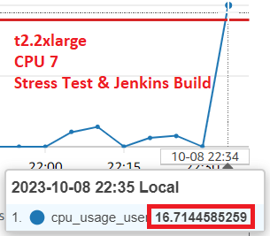

# Monitor Applications and Server Resources

October 7, 2023

By:  Annie V Lam - Kura Labs

# Purpose

After deploying the new version of the URL Shortener application, the QA engineer initiated 14,000 requests to the server; unfortunately, 500 of these requests encountered failures.

## Configuration for Testing

**Updated the application.py file to include logging**

**Configured Nginx in order for it to receive more request**

Updated from "worker_processes auto" to "worker_processes 8"

Updated from "worker_connections 768" to "worker_connections 2000"

Uncomment "Multi_accept on;

Uncomment all lines with "gzip.."

**Installed a package for stress testing**

sudo apt install stress-ng

**Added a shell script with a code to stress test**

sudo nice -n -20 stress-ng --cpu 2

This script stress tests two CPUs with high-priority

## Result of QA Engineer's 14,000 requests while running sudo nice -n -20 stress-ng --cpu 2

We were notified that we did not pass the QA testing, out of the 14,000 requests 500 requests failed.  We also received an email notification that our CPU usage was at 100%.

## SRE TESTING and ANALYSIS

Sending 14,000 requests to our server while running the script sudo nice -n -20 stress-ng --cpu 2 has severely strained our server.  The script sudo nice -n -20 stress-ng --cpu 2 sends workload to two of our cpus to test for resiliency.  

**SRE TESTING for t2.medium**

Here is an example of CPU usage on a t2.medium instance that has 2 CPUs running the stress test, sudo nice -n -20 stress-ng --cpu 2:

When running the stress test, sudo nice -n -20 stress-ng --cpu 2, in a t2.medium instance with no request and no Jenkins builds being run, both CPUs were already running at 99% capacity.  Two CPUs are not enough.  We would need to increase our CPU.  The next level up is 4 CPUs and the one after is 8 CPUs.  As we only use one server to handle all three tiers, the Web Tier, the Application Tier, and the Data Tier, 4 CPUs may also be stretching it.  

**SRE TESTING for t2.xlarge**

Here is an example of CPU usage on a t2.xlarge instance that has 4 CPUs running the stress test, sudo nice -n -20 stress-ng --cpu 2, and running multiple Jenkins builds:

When running the stress test, sudo nice -n -20 stress-ng --cpu 2, and running multiple Jenkins builds at the same time in a t2.xlarge instance, three of the CPUs were running at about 75% capacity or more and one CPU is running at about 14%. Under the current conditions, having 4 CPUs may not be able to handle also handle the stress of a minimum 14,000 requests. 

## Recommendations

1.  Increase the number of CPUs to 8.  There are a couple of options.  The t2.2xlarge or the c5.2xlarge.  The difference is that one has 32 GiB and the other has 16 GiB of memory respectively.  As this instance also hosts our data tier, the 32 GiB is recommended.
2.  Separate out the application tier and data tier into another instance.  We can put the web tier on an instance with 4 CPUs and the application and data tier on an instance with 2 CPUs.  This will have the benefit of making the application and web tier more secure.  However, having an additional instance will incur additional costs.  

## Implemented Solution

Created a new instance with t2.2xlarge instance type, please reference [deployment_4](https://github.com/LamAnnieV/deployment_4.git) on how to set up the instance and the required installs for the URL Shortener application.  Please note:
-  the instance type in deployment_4 was t2.medium, for this instance, we would need t2.2xlarge
-  this instance will be placed in the subnet "deploy_4-subnet-public2"
-  port 8000 will be removed from the security group
-  after the successful testing, the instance t2.medium instance type will be terminated.  

**SRE TESTING for t2.2xlarge**

Here is an example of CPU usage on a t2.2xlarge instance that has 8 CPUs running the stress test, sudo nice -n -20 stress-ng --cpu 2 and running multiple Jenkins builds:

All of the CPUs are "IN ALARM"

Two of the 8 CPUs are at 100% capacity, the other 6 CPUs usage are between 17% to 23% 
Individual CPU status:

The Jenkins Build ran successfully:

The URL Shortener is no longer able to launch from port 8000:

The URL Shortener launched from port 5000:

## Step #1 Diagram the VPC Infrastructure and the CI/CD Pipeline

## Step #2 GitHub/Git

GitHub serves as the repository from which Jenkins retrieves files to build, test, and deploy the URL Shortener application.  For this deployment, after the initial commit, the GitHub repository was cloned locally. Then a new branch was created, and the Jenkinsfile was edited with the necessary changes. The changes were committed and the second branch was subsequently merged into the main branch. Finally, the updated main branch was pushed to the GitHub repository.

In order for the EC2 instance, where Jenkins is installed, to access the repository, you need to generate a token from GitHub and then provide it to the EC2 instance.

[Generate GitHub Token](https://github.com/LamAnnieV/GitHub/blob/main/Generate_GitHub_Token.md)

## Step #3 Setup VPC and EC2 Infrastructure 

**Instructions to Setup the infrastructure for two private subnets and two public subnets**

[Setup VPC](https://github.com/LamAnnieV/Setup_VPC/blob/main/1_Setup_VPC.md)

[Setup Subnets](https://github.com/LamAnnieV/Setup_VPC/blob/main/2_Setup_Subnets.md)

[Setup Route Tables](https://github.com/LamAnnieV/Setup_VPC/blob/main/3_Setup_Route_Tables.md)

[Setup Internet Gateways](https://github.com/LamAnnieV/Setup_VPC/blob/main/4_Setup_Internet_Gateways.md)

**Instructions to Setup a New EC2 Instance**

[Create EC2 Instance](https://github.com/LamAnnieV/Create_EC2_Instance/blob/main/Create_EC2_Instance.md)

## Step #4 Installs for EC2 

**Shell Scripts for Python and other installs**

Python is used in the application and the test stage

[Install "python3.10-venv", "python3-pip" and "zip"](https://github.com/LamAnnieV/Instance_Installs/blob/main/02_other_installs.sh)

**Shell Scripts to Install Nginx**

Nginx is used as a web server for hosting the URL Shortener application

[Install Nginx](https://github.com/LamAnnieV/Instance_Installs/blob/main/Install_Ngnix.sh)

After Nginx was installed, edit the configuration file "/etc/nginx/sites-enabled/default" with the information below:

**Jenkins**

Jenkins is used to automate the Build, Test, and Deploy the URL Shortener Application.  To use Jenkins in a new EC2, all the proper installs to use Jenkins and to read the programming language that the application is written in need to be installed. In this case, they are Jenkins, Java, and Jenkins additional plugin "Pipeline Keep Running Step".

**Instructions for Jenkins Install and other Installs required for Jenkins**

[Install Jenkins](https://github.com/LamAnnieV/Instance_Installs/blob/main/01_jenkins_installs.sh)

[Install "Pipeline Keep Running Step" Plugin](https://github.com/LamAnnieV/Jenkins/blob/main/Install_Pipeline_Keep_Running_Step.md)

## Step #5 Configure CloudWatch and Create Alarms to Monitor Resources

CloudWatch is used to monitor our resource usage in our instance.

[Install/Configure CloudWatch](https://docs.aws.amazon.com/AmazonCloudWatch/latest/monitoring/install-CloudWatch-Agent-on-EC2-Instance-fleet.html)

Alarms allow you to set thresholds in CloudWatch, which will notify you when those thresholds are breached.

[How to create a CloudWatch alarm](https://docs.aws.amazon.com/AmazonCloudWatch/latest/monitoring/ConsoleAlarms.html)

## Step #6 Configure GitHub Webhook

When a commit is made in GitHub, the 'Run Build' process still needs to be manually initiated. To automate this workflow, we configured a GitHub Webhook. Now, whenever there is a commit in the GitHub Repository, the webhook automatically triggers Jenkins to push the files and initiate the Build process.

[Configure GitHub Webhook](https://github.com/LamAnnieV/GitHub/blob/main/Configure_GitHub_Webhook.md)

## Step #7 Configure Jenkins Build and Run Build

[Create Jenkins Multibranch Pipeline Build](https://github.com/LamAnnieV/Jenkins/blob/main/Jenkins_Multibranch_Pipeline_Build.md)

Jenkins Build:  In Jenkins create a build "Deployment_4" for the URL Shortener application from GitHub Repository https://github.com/LamAnnieV/deployment_4.git and run the build.  This build consists of four stages:  The Build, the Test, the Clean, and the Deploy stages.

### Results
**The build was successful, see build run #1 - 3**

**CloudWatch Monitoring for Build #1**

#### CloudWatch Monitoring for Build #2 and 3 that was run back to back

**Build #2 Resource Usage**

**Build #3 Resource Usage at the beginning of the build**

**Build #3 Resource Usage towards the end of the build**

**CloudWatch Notification that Resource Usage is over 15%**

**Launch URL Shortener Website**

### Conclusion

AWS offers various instance types with different resource capacities. If we base our instance type selection solely on running one build at a time, our current choice, the T2 Medium, seems a bit excessive, as we utilize only about 21% of the CPU capacity.

However, when we consider running builds consecutively, the CPU usage increases to 40%. If we were to use the T2 Micro instance type, which has one CPU, instead of the T2 Medium with two CPUs, our usage percentage would double to 80%. Operating at 80% capacity could potentially hinder performance or even lead to system crashes.

**AWS Instance Type Capacity**

## Issue(s): 

- Our initial build did not trigger an email notification, despite the CPU usage exceeding the set threshold of 15%. This issue may be related to the CloudWatch configuration, which typically takes a couple of minutes to become active after setup completion. In the future, we will conduct notification tests before relying on them in production.  
  
## Area(s) for Optimization:

-  Automate the AWS Cloud Infrastructure using Terraform

Note:  ChatGPT was used to enhance the quality and clarity of this documentation
  
